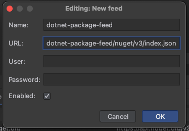

# BRICKMAKERS ASP.Net Core Security Headers
A small .net core package for ASP.Net Core to automatically configure secure HTTP-Headers.

- [Features](#features)
- [Installation](#installation)
  - [Setup per Project](#setup-per-project)
  - [Integration into DevOps Pipelines](#integration-into-devops-pipelines)
    - [Known issues](#known-issues)
  - [Setup via Rider](#setup-via-rider)
- [Usage](#usage)
- [Getting Help](#getting-help)

<small><i><a href='http://ecotrust-canada.github.io/markdown-toc/'>Table of contents generated with markdown-toc</a></i></small>

## Features
- Secure defaults for HTTP-Headers, CSP, Cookies and more
- Opt-Out mechanism for different security controls
- Easily configurable via `IApplicationBuilder.UseBmSecurityHeaders()` extension
  - Or use `IApplicationBuilder.UseBmApiSecurityHeaders()` for API-Projects
- Developed and Maintained by the BRICKMAKERS Security Advisory Team
- Easy integration in any project and build pipelines

## Installation
First, you need to add the package source to your project. Alternatively, you can check the guides
below on how to integrate the feed system-wide with Rider, you so don't have to repeat these steps
for every new project.

### Setup per Project
To add the feed to one specific project only, you have to create a `nuget.config` next to the
`.csproj` (or `.sln` to configure it for the whole solution). The contents of that file should be
as follows:

```.xml
<?xml version="1.0" encoding="utf-8"?>
<configuration>
  <packageSources>
    <add key="security-engineering-dotnet-package-feed" value="https://brickmakers.pkgs.visualstudio.com/SecurityEngineering/_packaging/security-engineering-dotnet-package-feed/nuget/v3/index.json" />
  </packageSources>
</configuration>
```

To add the package to your project, simply run the following command. The first time you do this,
you will be asked to log into the Azure DevOps portal. However, this will only work if you have the
[Azure Artifacts Credential Provider](https://github.com/microsoft/artifacts-credprovider#azure-artifacts-credential-provider)
installed.

```.sh
# Add package to project
dotnet add package --interactive de.brickmakers.SecurityEngineering.AspSecurityHeaders
# Restore Project
dotnet restore --interactive
```

**Important:** In order to prevent attacks against the package feed, you should enable lockfiles for 
your CS-Project. This can be done by adding `RestorePackagesWithLockFile` with `true` to to csproj file:

```.csproj
<Project>
  <PropertyGroup>
    ...
    <RestorePackagesWithLockFile>true</RestorePackagesWithLockFile>
    <!-- You can also add the following to prevent issues with outdated caches -->
    <DisableImplicitNuGetFallbackFolder>true</DisableImplicitNuGetFallbackFolder>
  </PropertyGroup>
  ...
 </Project>
```

### Integration into DevOps Pipelines
The integration into a DevOps Pipeline is fairly easy, as the package feed is available for the whole
organization BRICKMAKERS, meaning that all out pipelines have implicit access to the feed. All you
need to do is to tell the restore command to use the feed. When using the `DotNetCoreCLI@2` Task,
this can be done as follows:

```.yml
- task: DotNetCoreCLI@2
  displayName: Restore
  inputs:
    command: restore
    feedsToUse: select
    includeNuGetOrg: true
    feedRestore: SecurityEngineering/security-engineering-dotnet-package-feed
    projects: '**/MyProject.csproj'
    restoreArguments: --locked-mode  # required if RestorePackagesWithLockFile has been enabled
```

When using the package outside of the Brickmakers DevOps Repository, you have to explicitly
authenticate with it. This can be done by running the [NuGetAuthenticate@0](https://docs.microsoft.com/en-us/azure/devops/pipelines/tasks/package/nuget-authenticate?view=azure-devops)
task before restoring.

#### Known issues
When running the publish task, it will try to restore the package even if it has already been
restored. This leads to a whole slew of 403 errors in the logs, but the task will give up on
restoring after about a minute and publish anyways.

### Setup via Rider
You can add the feed as a global package source via Rider. You only have to do this once and the you
can use the package in all your dotnet projects.

First, select the `NuGet`-Tab at the bottom of the
screen. Next, select `Sources` and click the `+` button to add a new package source.


In the dialog, you have to enter a package name and the URL to the package feed. You should enter
the following values:

- Name: `security-engineering-dotnet-package-feed`
- URL: `https://brickmakers.pkgs.visualstudio.com/SecurityEngineering/_packaging/security-engineering-dotnet-package-feed/nuget/v3/index.json`

Finally, press OK and Rider will ask you to log into the Azure Dev-Ops portal.



Now you can add `de.brickmakers.SecurityEngineering.AspSecurityHeaders` just like any other normal
dependency.

## Usage
To get started, all you have to to is to register the middleware in the `Configure` method. This
should happen at the beginning of the method to ensure the headers are added to all responses, as
different middlewares might end processing early, which would prevent the headers from being set:

```.cs
public void Configure(IApplicationBuilder app)
{
    // Should be the first steps in the Configure method

    // For "normal" Websites or combinations of Websites and APIs
    app.UseBmSecurityHeaders();

    // For pure APIs
    app.UseBmApiSecurityHeaders();

    // ...
}
```

This will add *all* security headers, as well as a strict CSP and cookie policy. To further
configure it and opt out of certain security controls, you can use the `configure` parameter of the
method. In the following example, scripts, styles and images are allowed to be loaded from the
current origin and reduces the minimum cookie same site requirements to be lax instead of strict.

```.cs
public void Configure(IApplicationBuilder app)
{
    app.UseBmSecurityHeaders(collection => collection  // Or .UseBmApiSecurityHeaders for APIs
        .AddBmContentSecurityPolicy(builder =>
        {
            builder.AddScriptSrc().Self();
            builder.AddStyleSrc().Self();
            builder.AddImgSrc().Self();
        })
        .SetMinimumSameSitePolicy(SameSiteMode.Lax));

    // ...
}
```

## Getting Help
If you have any problems with the package or it's installation, feel free to contact me (Felix Barz)
or any other member of the Security Advisory Team. We meet every second Wednesday.
